# Guía de Reporte de Monitoreo (INFOBRAS)

## Pasos para realizar el Reporte de Monitoreo

### Registro 1: Código INFOBRAS 61867

Entidad: 398-MUNICIPALIDAD PROVINCIAL DE AMBO-HUANUCO

### PASO 1: Verificar en la sección de DATOS DE EJECUCIÓN

Validar en el sistema INFOBRAS la sección **Datos de ejecución** de la ficha pública de la obra.

**Nota:**
Verificar la **fecha de inicio** y **fecha de fin de ejecución de la obra** para confirmar si la actualización del registro de avance de obra está vigente.

**Ojo:**
Realizar la **primera captura de pantalla** en esta sección.

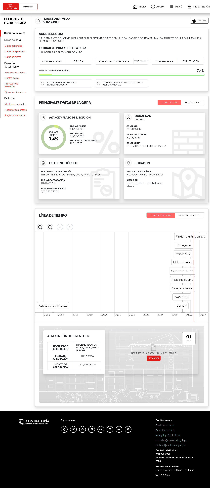

Fuente: https://infobras.contraloria.gob.pe/infobrasweb, consulta de fecha Tue May 12 2026 22:25:06 GMT-0500 (hora estándar de Perú).

### PASO 2: Verificar el detalle de AVANCES DE OBRA

En la sección de avances, revisar la tabla de periodos para confirmar:

- Año y mes de avance.
- Avance físico programado.
- Avance físico real.
- Avance valorizado programado.
- Avance valorizado real.
- % de ejecución financiera.
- Monto de ejecución financiera.
- Estado.

**Ojo:**
Abrir el botón **Ver detalle** y realizar la **segunda captura de pantalla** de la tabla.

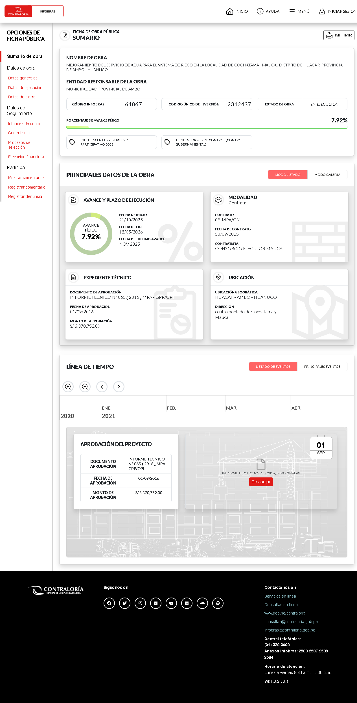

Fuente: https://infobras.contraloria.gob.pe/infobrasweb, consulta de fecha Tue May 12 2026 22:25:06 GMT-0500 (hora estándar de Perú).

---

### Registro 2: Código INFOBRAS 103632

Entidad: 226-UNIVERSIDAD NACIONAL AGRARIA DE LA SELVA - TINGO MARÍA-HUANUCO

### PASO 1: Verificar en la sección de DATOS DE EJECUCIÓN

Validar en el sistema INFOBRAS la sección **Datos de ejecución** de la ficha pública de la obra.

**Nota:**
Verificar la **fecha de inicio** y **fecha de fin de ejecución de la obra** para confirmar si la actualización del registro de avance de obra está vigente.

**Ojo:**
Realizar la **primera captura de pantalla** en esta sección.

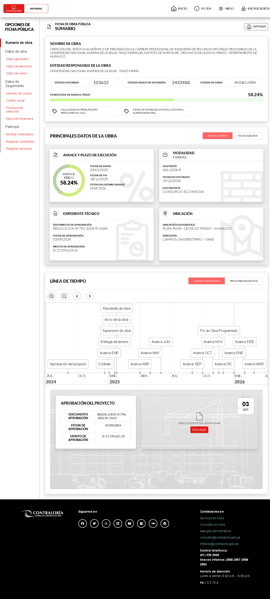

Fuente: https://infobras.contraloria.gob.pe/infobrasweb, consulta de fecha Tue May 12 2026 22:25:06 GMT-0500 (hora estándar de Perú).

### PASO 2: Verificar el detalle de AVANCES DE OBRA

En la sección de avances, revisar la tabla de periodos para confirmar:

- Año y mes de avance.
- Avance físico programado.
- Avance físico real.
- Avance valorizado programado.
- Avance valorizado real.
- % de ejecución financiera.
- Monto de ejecución financiera.
- Estado.

**Ojo:**
Abrir el botón **Ver detalle** y realizar la **segunda captura de pantalla** de la tabla.

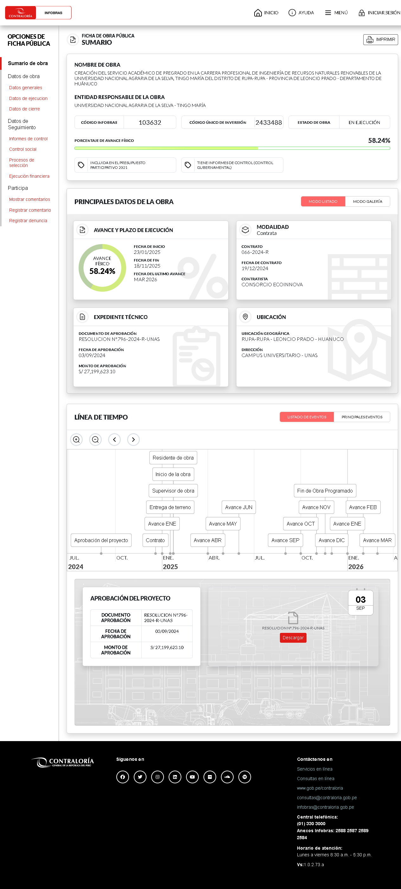

Fuente: https://infobras.contraloria.gob.pe/infobrasweb, consulta de fecha Tue May 12 2026 22:25:06 GMT-0500 (hora estándar de Perú).

---

### Registro 3: Código INFOBRAS 110466

Entidad: 1816-MUNICIPALIDAD DISTRITAL DE CHINCHAO-HUANUCO

### PASO 1: Verificar en la sección de DATOS DE EJECUCIÓN

Validar en el sistema INFOBRAS la sección **Datos de ejecución** de la ficha pública de la obra.

**Nota:**
Verificar la **fecha de inicio** y **fecha de fin de ejecución de la obra** para confirmar si la actualización del registro de avance de obra está vigente.

**Ojo:**
Realizar la **primera captura de pantalla** en esta sección.

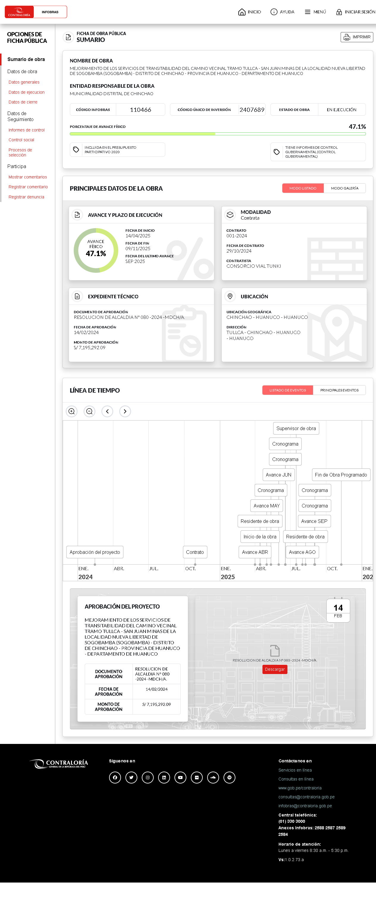

Fuente: https://infobras.contraloria.gob.pe/infobrasweb, consulta de fecha Tue May 12 2026 22:25:06 GMT-0500 (hora estándar de Perú).

### PASO 2: Verificar el detalle de AVANCES DE OBRA

En la sección de avances, revisar la tabla de periodos para confirmar:

- Año y mes de avance.
- Avance físico programado.
- Avance físico real.
- Avance valorizado programado.
- Avance valorizado real.
- % de ejecución financiera.
- Monto de ejecución financiera.
- Estado.

**Ojo:**
Abrir el botón **Ver detalle** y realizar la **segunda captura de pantalla** de la tabla.

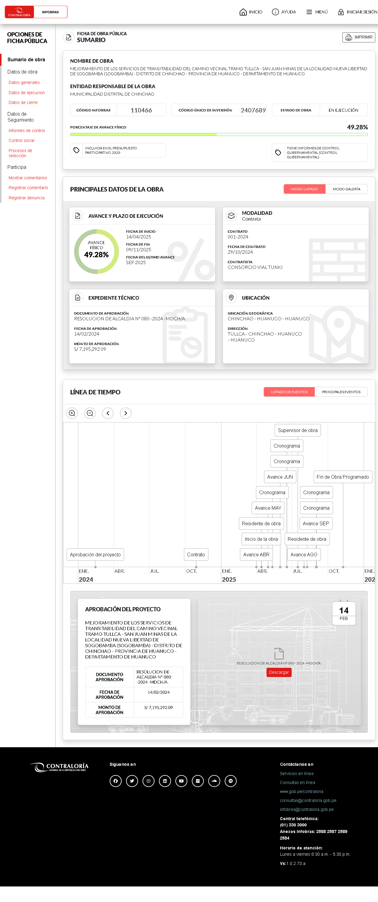

Fuente: https://infobras.contraloria.gob.pe/infobrasweb, consulta de fecha Tue May 12 2026 22:25:06 GMT-0500 (hora estándar de Perú).

---

### Registro 4: Código INFOBRAS 132479

Entidad: 1872-MUNICIPALIDAD DISTRITAL DE CHAGLLA-HUANUCO

### PASO 1: Verificar en la sección de DATOS DE EJECUCIÓN

Validar en el sistema INFOBRAS la sección **Datos de ejecución** de la ficha pública de la obra.

**Nota:**
Verificar la **fecha de inicio** y **fecha de fin de ejecución de la obra** para confirmar si la actualización del registro de avance de obra está vigente.

**Ojo:**
Realizar la **primera captura de pantalla** en esta sección.

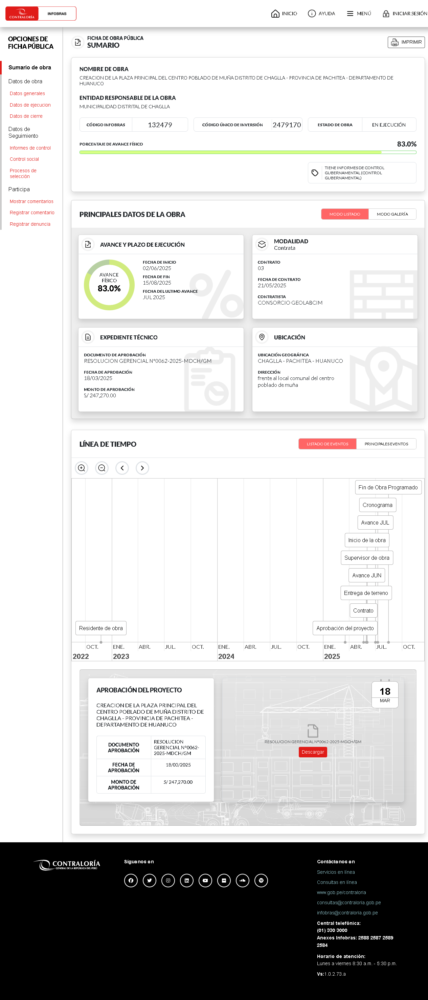

Fuente: https://infobras.contraloria.gob.pe/infobrasweb, consulta de fecha Tue May 12 2026 22:25:06 GMT-0500 (hora estándar de Perú).

### PASO 2: Verificar el detalle de AVANCES DE OBRA

En la sección de avances, revisar la tabla de periodos para confirmar:

- Año y mes de avance.
- Avance físico programado.
- Avance físico real.
- Avance valorizado programado.
- Avance valorizado real.
- % de ejecución financiera.
- Monto de ejecución financiera.
- Estado.

**Ojo:**
Abrir el botón **Ver detalle** y realizar la **segunda captura de pantalla** de la tabla.

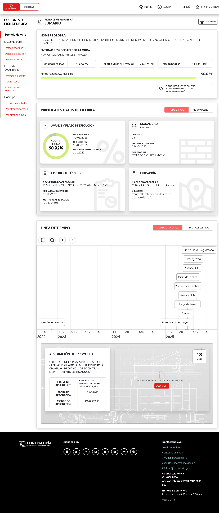

Fuente: https://infobras.contraloria.gob.pe/infobrasweb, consulta de fecha Tue May 12 2026 22:25:06 GMT-0500 (hora estándar de Perú).

---

### Registro 5: Código INFOBRAS 161112

Entidad: 257-CORPORACION PERUANA DE AEROPUERTOS Y AVIACION COMERCIAL SOCIEDAD ANONIMA - CORPAC S.A.-HUANUCO

### PASO 1: Verificar en la sección de DATOS DE EJECUCIÓN

Validar en el sistema INFOBRAS la sección **Datos de ejecución** de la ficha pública de la obra.

**Nota:**
Verificar la **fecha de inicio** y **fecha de fin de ejecución de la obra** para confirmar si la actualización del registro de avance de obra está vigente.

**Ojo:**
Realizar la **primera captura de pantalla** en esta sección.

Fuente: https://infobras.contraloria.gob.pe/infobrasweb, consulta de fecha Tue May 12 2026 22:25:06 GMT-0500 (hora estándar de Perú).

### PASO 2: Verificar el detalle de AVANCES DE OBRA

En la sección de avances, revisar la tabla de periodos para confirmar:

- Año y mes de avance.
- Avance físico programado.
- Avance físico real.
- Avance valorizado programado.
- Avance valorizado real.
- % de ejecución financiera.
- Monto de ejecución financiera.
- Estado.

**Ojo:**
Abrir el botón **Ver detalle** y realizar la **segunda captura de pantalla** de la tabla.

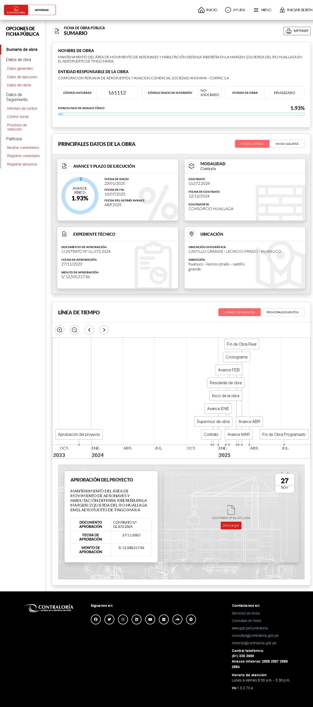

Fuente: https://infobras.contraloria.gob.pe/infobrasweb, consulta de fecha Tue May 12 2026 22:25:06 GMT-0500 (hora estándar de Perú).

---

### Registro 6: Código INFOBRAS 500865

Entidad: 3859-MUNICIPALIDAD PROVINCIAL DE LAURICOCHA-HUANUCO

### PASO 1: Verificar en la sección de DATOS DE EJECUCIÓN

Validar en el sistema INFOBRAS la sección **Datos de ejecución** de la ficha pública de la obra.

**Nota:**
Verificar la **fecha de inicio** y **fecha de fin de ejecución de la obra** para confirmar si la actualización del registro de avance de obra está vigente.

**Ojo:**
Realizar la **primera captura de pantalla** en esta sección.

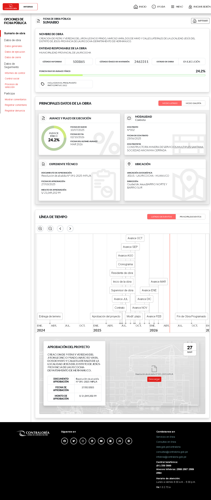

Fuente: https://infobras.contraloria.gob.pe/infobrasweb, consulta de fecha Tue May 12 2026 22:25:06 GMT-0500 (hora estándar de Perú).

### PASO 2: Verificar el detalle de AVANCES DE OBRA

En la sección de avances, revisar la tabla de periodos para confirmar:

- Año y mes de avance.
- Avance físico programado.
- Avance físico real.
- Avance valorizado programado.
- Avance valorizado real.
- % de ejecución financiera.
- Monto de ejecución financiera.
- Estado.

**Ojo:**
Abrir el botón **Ver detalle** y realizar la **segunda captura de pantalla** de la tabla.

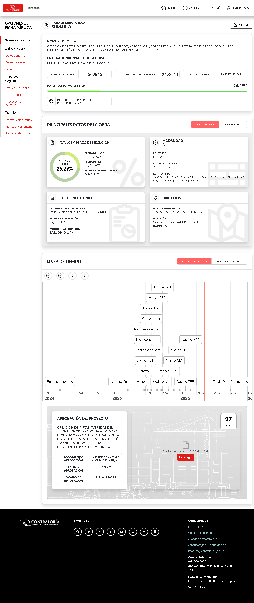

Fuente: https://infobras.contraloria.gob.pe/infobrasweb, consulta de fecha Tue May 12 2026 22:25:06 GMT-0500 (hora estándar de Perú).

---

### Registro 7: Código INFOBRAS 506766

Entidad: 226-UNIVERSIDAD NACIONAL AGRARIA DE LA SELVA - TINGO MARÍA-HUANUCO

### PASO 1: Verificar en la sección de DATOS DE EJECUCIÓN

Validar en el sistema INFOBRAS la sección **Datos de ejecución** de la ficha pública de la obra.

**Nota:**
Verificar la **fecha de inicio** y **fecha de fin de ejecución de la obra** para confirmar si la actualización del registro de avance de obra está vigente.

**Ojo:**
Realizar la **primera captura de pantalla** en esta sección.

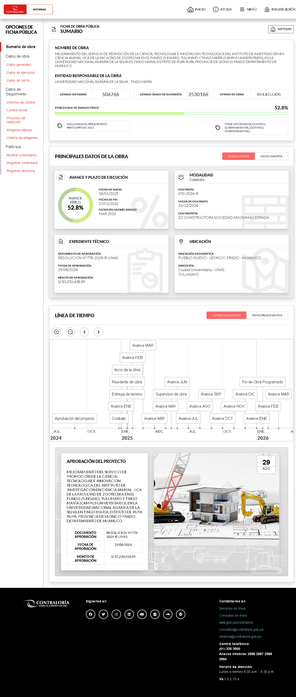

Fuente: https://infobras.contraloria.gob.pe/infobrasweb, consulta de fecha Tue May 12 2026 22:25:06 GMT-0500 (hora estándar de Perú).

### PASO 2: Verificar el detalle de AVANCES DE OBRA

En la sección de avances, revisar la tabla de periodos para confirmar:

- Año y mes de avance.
- Avance físico programado.
- Avance físico real.
- Avance valorizado programado.
- Avance valorizado real.
- % de ejecución financiera.
- Monto de ejecución financiera.
- Estado.

**Ojo:**
Abrir el botón **Ver detalle** y realizar la **segunda captura de pantalla** de la tabla.

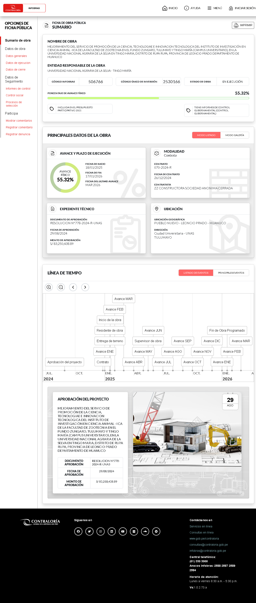

Fuente: https://infobras.contraloria.gob.pe/infobrasweb, consulta de fecha Tue May 12 2026 22:25:06 GMT-0500 (hora estándar de Perú).

---

### Registro 8: Código INFOBRAS 509919

Entidad: 402-MUNICIPALIDAD PROVINCIAL DE LEONCIO PRADO-HUANUCO

### PASO 1: Verificar en la sección de DATOS DE EJECUCIÓN

Validar en el sistema INFOBRAS la sección **Datos de ejecución** de la ficha pública de la obra.

**Nota:**
Verificar la **fecha de inicio** y **fecha de fin de ejecución de la obra** para confirmar si la actualización del registro de avance de obra está vigente.

**Ojo:**
Realizar la **primera captura de pantalla** en esta sección.

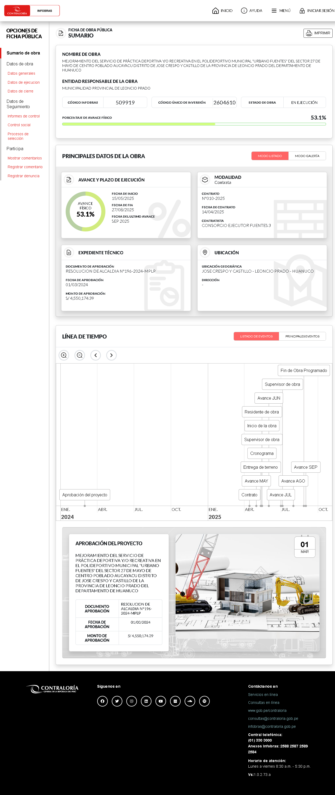

Fuente: https://infobras.contraloria.gob.pe/infobrasweb, consulta de fecha Tue May 12 2026 22:25:06 GMT-0500 (hora estándar de Perú).

### PASO 2: Verificar el detalle de AVANCES DE OBRA

En la sección de avances, revisar la tabla de periodos para confirmar:

- Año y mes de avance.
- Avance físico programado.
- Avance físico real.
- Avance valorizado programado.
- Avance valorizado real.
- % de ejecución financiera.
- Monto de ejecución financiera.
- Estado.

**Ojo:**
Abrir el botón **Ver detalle** y realizar la **segunda captura de pantalla** de la tabla.

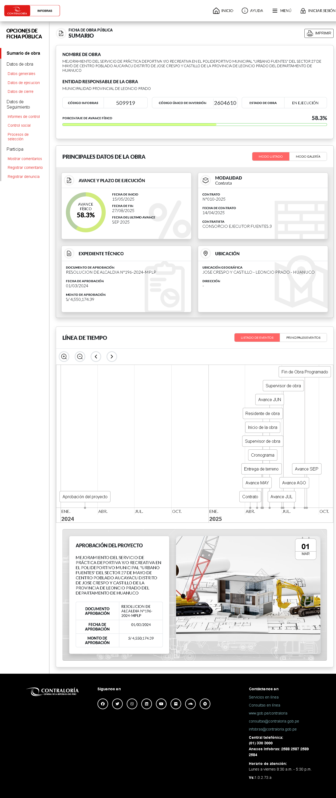

Fuente: https://infobras.contraloria.gob.pe/infobrasweb, consulta de fecha Tue May 12 2026 22:25:06 GMT-0500 (hora estándar de Perú).

---

### Registro 9: Código INFOBRAS 511773

Entidad: 1816-MUNICIPALIDAD DISTRITAL DE CHINCHAO-HUANUCO

### PASO 1: Verificar en la sección de DATOS DE EJECUCIÓN

Validar en el sistema INFOBRAS la sección **Datos de ejecución** de la ficha pública de la obra.

**Nota:**
Verificar la **fecha de inicio** y **fecha de fin de ejecución de la obra** para confirmar si la actualización del registro de avance de obra está vigente.

**Ojo:**
Realizar la **primera captura de pantalla** en esta sección.

Fuente: https://infobras.contraloria.gob.pe/infobrasweb, consulta de fecha Tue May 12 2026 22:25:06 GMT-0500 (hora estándar de Perú).

### PASO 2: Verificar el detalle de AVANCES DE OBRA

En la sección de avances, revisar la tabla de periodos para confirmar:

- Año y mes de avance.
- Avance físico programado.
- Avance físico real.
- Avance valorizado programado.
- Avance valorizado real.
- % de ejecución financiera.
- Monto de ejecución financiera.
- Estado.

**Ojo:**
Abrir el botón **Ver detalle** y realizar la **segunda captura de pantalla** de la tabla.

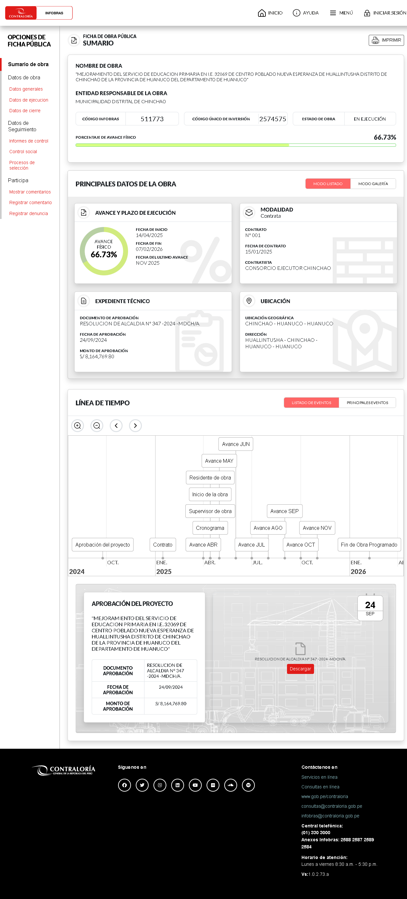

Fuente: https://infobras.contraloria.gob.pe/infobrasweb, consulta de fecha Tue May 12 2026 22:25:06 GMT-0500 (hora estándar de Perú).

---

## Relación con la automatización actual

La automatización vigente recorre esta ruta para cada código del CSV:

1. Abrir INFOBRAS.
2. Ir a la búsqueda.
3. Buscar por código INFOBRAS.
4. Abrir ficha pública.
5. Entrar a Datos de ejecución.
6. Capturar evidencias y generar documento automáticamente.

Archivo de datos de entrada usado por el flujo automatizado:

- `src/input/codigos_infobras.csv`